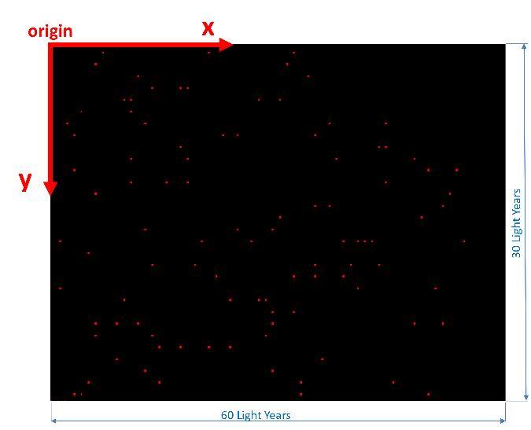
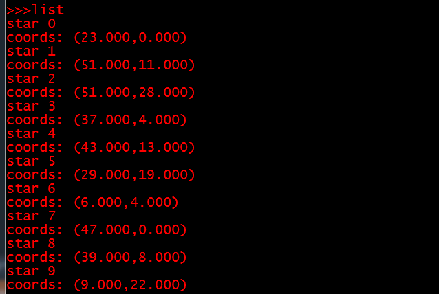
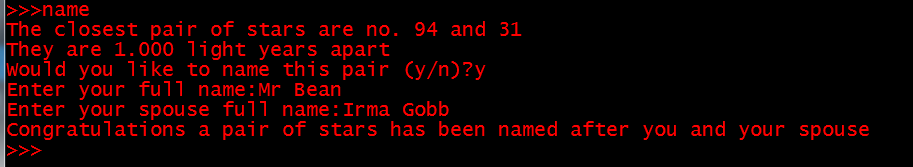
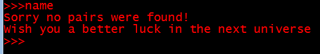
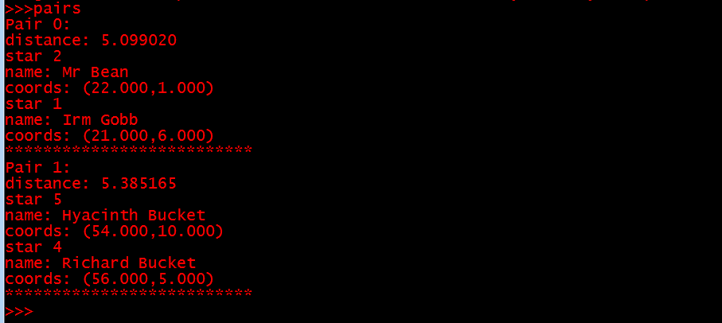
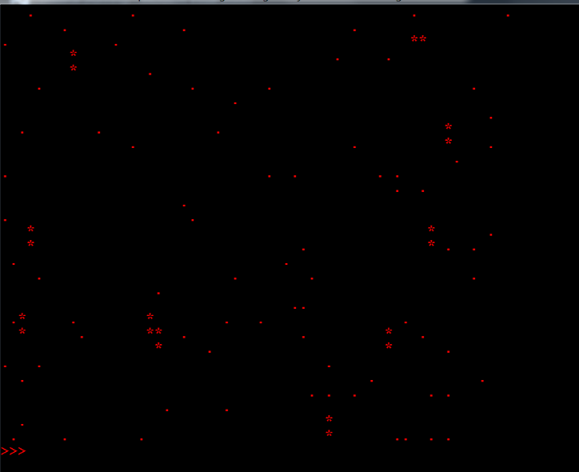
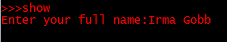
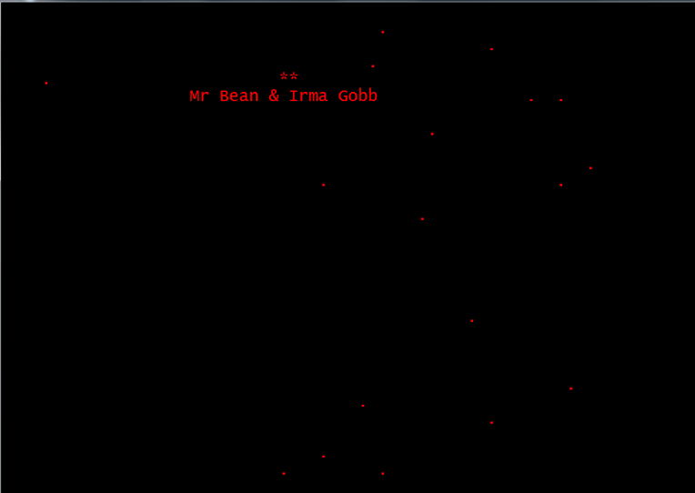
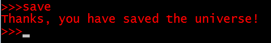
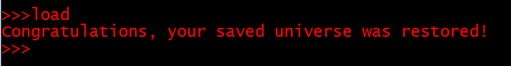

# **Big Bang**

## The Details

An astronomer wanted to surprise their spouse on their anniversary by showing them a simulation of the Big Bang on a computer, then naming the closest pair of stars created by this Big Bang with their names. Big Bang is the name of a cosmological theory that assumes that the universe started from the expansion of a single very high-density singularity. 

Fortunately, the program is not supposed to go anywhere close to a real simulation of the Big Bang. For the purposes of this simple program, our Big Bang simply fills a flat rectangular space with stars scattered at random positions. The program then allows a user to find the closest pair of unnamed stars in this universe and assign the user’s name to the first star in this pair, and the name of the user’s spouse to the second star.

## How to run it

`cc -std=c99 -lm uni.h graph.c logic.c main.c`
`./a.out`

## Build-in Commands

### The bang command

This command creates a hypothetical universe comprised of stars only. The stars should be randomly scattered across the universe.

We are assuming that the universe is flat and rectangular and is 60 light years long and 30 light years wide. A light year is a unit of measure of distance and is equal to the distance that light can travel in one year (5.879x1012 miles). Do not get daunted by this jargon, just assume that your space is a rectangle 60 units long and 30 units wide.

The bang command takes one integer argument representing the number of stars to be created. For example, if the player types:

\>>> bang 100

the program will create 100 stars randomly distributed within the universe (the 60x30 rectangle). The position of a star is determined by two coordinates, x and y. No two stars should have the same coordinates. For simplicity, assume that x and y are both integers. Also assume that the origin of the coordinate system is at the upper left corner of the universe, with the x axis pointing to the right, and the y axis pointing downwards, as shown in the following figure:

 

Note that in the above figure, the aspect ratio (ratio of height to width) of the universe is distorted. The reason for this will be explained later on.

It is important to keep the origin of the coordinate system at the upper left corner, and the directions of the axes as shown. Changing these assumptions could make it more difficult to implement the drawing functions of the game.

Each star must have a unique serial number (id) generated by the program when the universe is created. Initially, stars have no names, but players can later name stars using the **name** command (see below).

If the bang command is issued again (after a universe has been created), the existing universe is destroyed and a new one is created in its place.

### The list command

This command simply prints a list of all stars in the universe. For each star, the command prints the star’s serial number, name (if the star is named), and the star’s x and y coordinates. For example, if the player types:

\>>> list

the program prints a list similar to this one:

 

Note that in the above list none of the stars has a name, which is the situation when a new universe is created.

### The name command

This command is used to find the closest pair of stars that has ***\*not\**** been named yet and allow the user to name this pair. The program prompts the user to enter their name and that of their spouse. The first star in the pair is named after the player, and the second is named after the player’s spouse. Once a pair of stars is named, this pair is permanently reserved for its ‘owners’ and cannot be renamed by other players. Here is an example of the name command:

 

However, if all pairs have already been named, the program prints a message similar to this:

 

 

### The pairs command

This command prints a list of all star pairs that have been named so far. For each pair, the program prints the pair’s number, the distance between the two stars of this pair, and the details of the two stars. Here is an example:

 

### The draw command

This command is used to draw the universe. Named stars appear as asterisks (\*), while unnamed stars appear as dots (\.). Here is an example:

 

You will ***\*NOT\**** be using any graphics library to draw the universe. Instead, you will use a simple trick to convert the standard terminal to a primitive drawing window. This will be explained below.

### The show command

This command is used to display the names of the couple who own a pair of stars. When this command is executed the program prompts the user to enter their name as shown below 

 

The program then searches for a pair of stars named after this user, and if a pair is found, the program displays the names of the couple who own the pair under the stars of this pair, as shown in the following example:

 

 

### The save command

This command is used to save the universe. By this we don’t mean saving the universe from the evils of a supervillain. Instead, this command saves the program’s data into a file. The command should save all stars and all named pairs in the universe into a ***\*binary\**** file called universe.bin located in the program’s directory. Here is an example:

 

### The load command

This command is used to load (read) saved data from the universe.bin file. When the command is executed the program reverts to the point at which it was saved.

 

### The quit command

This command is used to terminate the program.